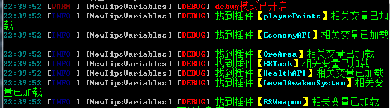
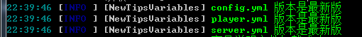

# NewTipsVariables
[](LICENSE)

[](https://github.com/stevei5mc/NewTipsVariables/releases)  


  
## **插件介绍**
### **前言**
- **该插件可以为Tips提供更多的变量内容**  
- **目前该插件正处于`beta`测试阶段如果有问题请及时提交[issues](https://github.com/stevei5mc/NewTipsVariables/issues)**  
- **如果你有开发能力可以为其提供[PR](https://github.com/stevei5mc/NewTipsVariables/pulls)来增加更多变量或修复问题**
### **[支持下列插件](./docs/SupportPluginsVariables.md "点击查看变量文档")**
**EconomyAPI HealthAPI LevelAwakenSystem OreArea playerPoints RsTask RsWeapon LuckPerms** 
### **命令与权限节点**
|命令|权限节点|权限介绍|默认权限|
|:-:|:-:|:-:|:-:|
|/newtipsariables|newtipsariables.admin|主命令|OP|
|/newtipsariables reload|newtipsariables.admin.reload|重载配置文件|OP|
### **变量介绍文档**
- **[文字相关变量][i2]**
- **[玩家相关变量][i3]**
- **[服务器相关变量][i4]**
- **[支持下列插件](./docs/SupportPluginsVariables.md "点击查看变量文档")**
### **配置文件使用说明**
- **若未在此说明中写配置项出则代表该配置项还没有支持,也有可能是忘记写出来了**
- **给出的预览图片可能不是最新的，但也差不到哪去**

<details>
<summary>config.yml</summary>

**[查看原文件](../src/main/resources/config.yml)**
```yaml
#使用说明:
#https://github.com/stevei5mc/NewTipsVariables/blob/main/README.md
#https://gitee.com/stevei5mc/NewTipsVariables/blob/main/README.md
#配置文件版本，勿动
version: 1
# 更新功能(这个功能展示没有用)
updata:
  in-plugin:
    #检查更新(暂时没有用)
    check: false
    #自动更新(需开启检查更新但暂时没有用)
    auto: false
  in-config:
    #检查更新
    check: false
    #自动更新(需开启检查更新)
    auto: false
# 是否释放新的变量说明文档
save-variables-doc: true
debug: false
```

1. `save-variables-doc` 该功能关闭后就算删除变量文档也不会生成新的变量文档
2. `debug` 显示一些额外的信息  
  
3. `updata -> in-config -> check` 配置文件版本检查
4. `updata -> in-config -> auto` 配置文件自动更新(需开启检查更新)**注意： 开启后配置文件将强制更新不会保留原来的配置**  

</details>
<details>
<summary>server.yml</summary>

**[查看原文件](../src/main/resources/server.yml)**
```yml
#使用说明:
#https://github.com/stevei5mc/NewTipsVariables/blob/main/README.md
#https://gitee.com/stevei5mc/NewTipsVariables/blob/main/README.md
#配置文件版本，勿动
version: 1
TPS:
  low_color: "§c"
  medium_value: 9
  medium_color: "§e"
  high_value: 15
  high_color: "§a"
```
1. ```color```设置显示的颜色，```low```、```medium```、```high```为显示的范围 
2. ```value```是一个范围值，```medium```、```high```为可设置的范围值，```low```值只能为```0```
</details>
<details>
<summary>player.yml</summary>

**[查看原文件](../src/main/resources/player.yml)**
```yml
#使用说明:
#https://github.com/stevei5mc/NewTipsVariables/blob/main/README.md
#https://gitee.com/stevei5mc/NewTipsVariables/blob/main/README.md
#配置文件版本，勿动
version: 1
Device:
  OS:
    Android: "Android"
    iOS: "iOS"
    macOS: "macOS"
    Fire_OS: "Fire OS"
    Gear_VR: "Gear VR"
    HoloLens: "HoloLens"
    Windows_10: "Windows 10"
    Windows: "Windows"
    Dedicated: "Dedicated"
    tvOS: "tvOS"
    PlayStation: "PlayStation"
    Switch: "Switch"
    Xbox: "Xbox"
    Windows_Phone: "Windows Phone"
  Controls:
    Keyboard: Keyboard
    Touch: Touch
    pad: pad
    motion_controller: motion_controller
  UIProfile:
    classic: "classic ui"
    pocket: "pocket ui"
ping:
  low_color: "§a"
  medium_value: 80
  medium_color: "§e"
  high_value: 120
  high_color: "§c"
HP:
  low_color: "§c{0}§7/§c{1}"
  medium_value: 9
  medium_color: "§e{0}§7/§e{1}"
  high_value: 15
  high_color: "§a{0}§7/§a{1}"
Food:
  empty_color: "§7{0}/{1}"
  low_color: "§c{0}§7/§c{1}"
  medium_value: 9
  medium_color: "§e{0}§7/§e{1}"
  high_value: 15
  high_color: "§a{0}§7/§a{1}"
```
1. `color`设置显示的颜色，`low`、`medium`、`high`为显示的范围  
2. `value`是一个范围值，`medium`、`high` 为可设置的范围值，`empty`值只能为`0`，`low`值只能为`0`或`1`
- **`Device -> OS`玩家的设备系统**  
- **`Device -> Controls`获取玩家设备的操作方式**
- **`Device -> UIProfile`玩家的设备UI**
- **`ping` 玩家的延迟**
- **`HP`  玩家的血量**
- **`Food` 玩家的饥饿值**
---
</details>

## **使用方法**
|使用步骤|使用说明|
|:-:|:-|
|1|将插件放进`plugins`文件夹|
|2|确保安装前置插件[Tips](https://motci.cn/job/Tips/)后重启（启动）服务器|
|3|在`./plugins/NewTipsVariables`文件夹中的`.txt`文件获取相关变量介绍，也可在本页面获取相关的变量介绍就可以在Tips中使用同时也可以在支持Tips变量的插件中使用|
## **注意事项及建议**
1. **不建议开启配置文件的自动更新，如果开启后配置文件有更新会覆盖式更新就会导致原有的配置丢失**
2. **预计发布beta10之后如果没有问题发布正式版该版本，有问题或者需求请及时提出[issue](https://github.com/stevei5mc/NewTipsVariables/issues)**
3. **建议备份好已经配置好的配置文件以备不时之需**

[i2]: ./docs/text-variables.md "点击查看变量文档"
[i3]: ./docs/player-variables.md "点击查看变量文档"
[i4]: ./docs/server-variables.md "点击查看变量文档"
[i5]: ./docs/config-info.md "点击查看配置文件相关介绍"