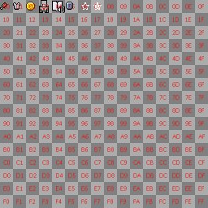
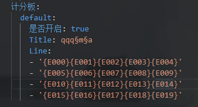
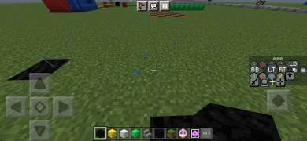
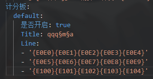

# **变量文档 （基础变量）**

## **文字相关**
|变量名|对应内容|变量名|对应内容|变量名|对应内容|变量名|对应内容|
|:-:|:-:|:-:|:-:|:-:|:-:|:-:|:-:|
|{text-s0}|§0|{text-s1}|§1|{text-s2}|§2|{text-s3}|§3|
|{text-s4}|§4|{text-s5}|§5|{text-s6}|§6|{text-s7}|§7|
|{text-s8}|§8|{text-s9}|§9|{text-sa}|§a|{text-sb}|§b|
|{text-sc}|§c|{text-sd}|§d|{text-se}|§e|{text-sf}|§f|
|{text-bold}|§l|{text-italic}|§o|{text-reset}|§r|{text-mess}|§k|
|{text-next}|\n|||||||
## **玩家相关**
|变量|介绍|备注|
|:-:|:-:|:-:|
|{Player-Xp}|获取玩家在游戏中的经验等级||
|{Device-Model}|获取玩家使用的设备型号||
|{XUID}|获取玩家的xuid||
|{Player-Lang}|获取玩家客户端使用的语言||
|{Player-Ui}|获取玩家客户端使用的UI||
|{Device-Os}|获取玩家设备的系统||
|{{Player-Uuid}|获取玩家的uuid||
|{Player-Ping}|获取玩家当前的延迟||
|{Player-Food}|获取玩家当前的饥饿度||
|{Player-Health}|获取玩家当前的血量||
|{Player-World}|获取玩家所在的世界|**需在world_name.yml配置相关内容方可生效**|
|{Player-Controls}|获取玩家设备的操作方式||
|{Player-Yaw}|获取玩家的Yaw值||
|{Player-Pitch}|获取玩家的Pitch值||
|{Player-HeadYaw}|获取玩家的HeadYaw值||
## **服务器相关**
|变量|介绍|备注|
|:-:|:-:|:-:|
|{Server-Motd}|获取服务器主motd||
|{Server-SubMotd}|获取服务器副motd||
|{Server-Ip}|获取服务器IP||
|{Server-Port}|获取服务器端口||
|{Server-Tps}|获取服务器当前TPS||
|{WorldOnline@世界名}|获取指定世界的人数||
## **unicode相关变量**
- **例如你想要显示金币的图标那么就要确定金币图标所在的位置**  
   
- **glyph_E1.png**  
---
- **如上图所示金币的图标在glyph_E1的第0行第2列(16进制表示)** 
- **那么金币图标的变量就为`{E102}`** 
- **其他的图标变量值也是这么确定的**
- **注意变量必须要以 `{`开头 `}`结尾 中间是图标所在位置 例`E102`** 

### **使用预览**
|||
|-|-|
|||