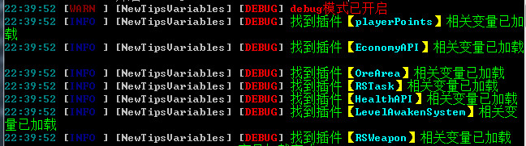

[](.././README.md) [](./config-info.md) [](./text-variables.md)
[](./player-variables.md)
[](./server-variables.md)
[](./SupportPluginsVariables.md)

---
# **配置文件使用说明**
- **若未在此说明中写配置项出则代表该配置项还没有支持,也有可能是忘记写出来了**
- **给出的预览图片可能不是最新的，但也差不到哪去**
---
## **[config.yml](../src/main/resources/config.yml)**
**主配置文件**
```yml
#使用说明:
#https://github.com/stevei5mc/NewTipsVariables/blob/main/README.md
#https://gitee.com/stevei5mc/NewTipsVariables/blob/main/README.md
#配置文件版本，勿动
version: 1
# 更新功能(这个功能展示没有用)
updata:
  in-plugin:
    #检查更新(暂时没有用)
    check: false
    #自动更新(需开启检查更新但暂时没有用)
    auto: false
  in-config:
    #检查更新
    check: false
    #自动更新(需开启检查更新)
    auto: false
# 是否释放新的变量说明文档
save-variables-doc: true
debug: false
```
1. `save-variables-doc` 该功能关闭后就算删除变量文档也不会生成新的变量文档
2. `debug` 显示一些额外的信息  
  
3. `updata -> in-config -> check` 配置文件版本检查
4. `updata -> in-config -> auto` 配置文件自动更新(需开启检查更新)**注意： 开启后配置文件将强制更新不会保留原来的配置**  

---
## **[server.yml](../src/main/resources/server.yml)**
**服务器相关变量配置文件**
```yml
#使用说明:
#https://github.com/stevei5mc/NewTipsVariables/blob/main/README.md
#https://gitee.com/stevei5mc/NewTipsVariables/blob/main/README.md
#配置文件版本，勿动
version: 1
TPS:
  low_color: "§c"
  medium_value: 9
  medium_color: "§e"
  high_value: 15
  high_color: "§a"
```
1. ```color```设置显示的颜色，```low```、```medium```、```high```为显示的范围 
2. ```value```是一个范围值，```medium```、```high```为可设置的范围值，```low```值只能为```0```
---
## **[player.yml](../src/main/resources/player.yml)**
**玩家相关变量配置文件**
```yml
#使用说明:
#https://github.com/stevei5mc/NewTipsVariables/blob/main/README.md
#https://gitee.com/stevei5mc/NewTipsVariables/blob/main/README.md
#配置文件版本，勿动
version: 1
Device:
  OS:
    Android: "Android"
    iOS: "iOS"
    macOS: "macOS"
    Fire_OS: "Fire OS"
    Gear_VR: "Gear VR"
    HoloLens: "HoloLens"
    Windows_10: "Windows 10"
    Windows: "Windows"
    Dedicated: "Dedicated"
    tvOS: "tvOS"
    PlayStation: "PlayStation"
    Switch: "Switch"
    Xbox: "Xbox"
    Windows_Phone: "Windows Phone"
  Controls:
    Keyboard: Keyboard
    Touch: Touch
    pad: pad
    motion_controller: motion_controller
  UIProfile:
    classic: "classic ui"
    pocket: "pocket ui"
ping:
  low_color: "§a"
  medium_value: 80
  medium_color: "§e"
  high_value: 120
  high_color: "§c"
HP:
  low_color: "§c{0}§7/§c{1}"
  medium_value: 9
  medium_color: "§e{0}§7/§e{1}"
  high_value: 15
  high_color: "§a{0}§7/§a{1}"
Food:
  empty_color: "§7{0}/{1}"
  low_color: "§c{0}§7/§c{1}"
  medium_value: 9
  medium_color: "§e{0}§7/§e{1}"
  high_value: 15
  high_color: "§a{0}§7/§a{1}"
```
1. `color`设置显示的颜色，`low`、`medium`、`high`为显示的范围  
2. `value`是一个范围值，`medium`、`high` 为可设置的范围值，`empty`值只能为`0`，`low`值只能为`0`或`1`
- **`Device -> OS`玩家的设备系统**  
- **`Device -> Controls`获取玩家设备的操作方式**
- **`Device -> UIProfile`玩家的设备UI**
- **`ping` 玩家的延迟**
- **`HP`  玩家的血量**
- **`Food` 玩家的饥饿值**
---